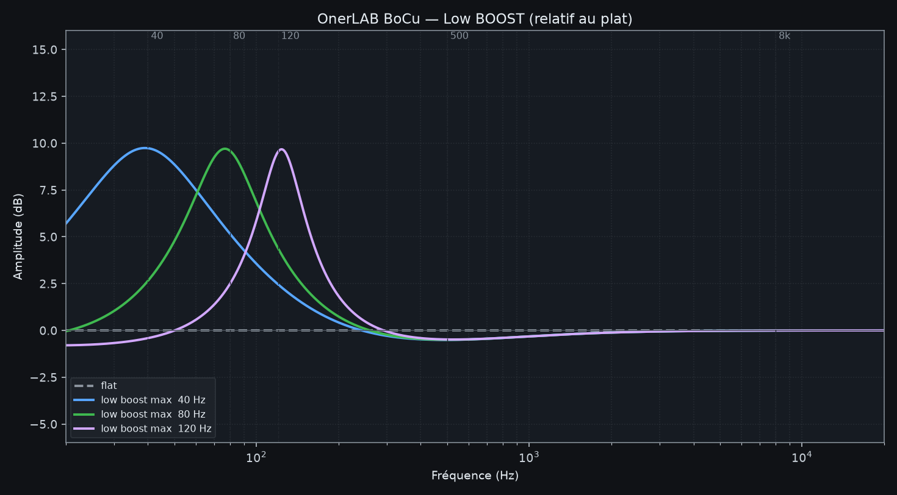
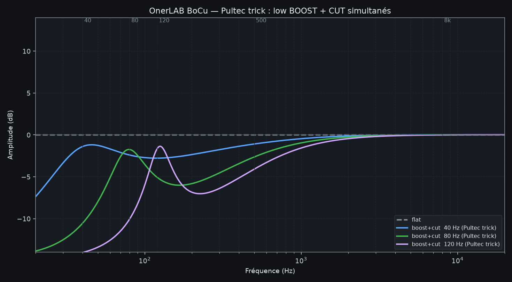
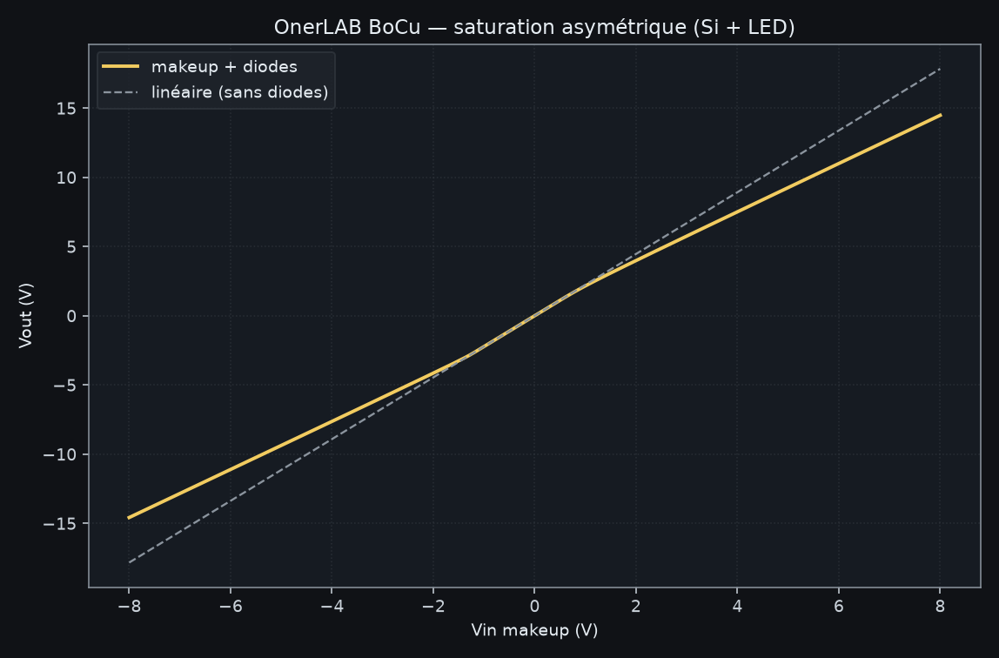

# OnerLAB BoCu

Module Eurorack **stéréo de fin de chaîne** : EQ type Pultec (sans tubes) + saturation douce à diodes + sorties jack 6,35 mm balanced.

- **Format** : 16 HP, 3U, alimentation ±12 V (header Doepfer 10 broches)
- **Entrées** : 2 × jack 3,5 mm mono (standard Eurorack), normalisées L → R
- **Sorties** : 2 × jack 6,35 mm TRS balanced (L / R)
- **PCB** : KiCad 7, netlist complète, **non routé** (placement fin + autorouter à ta main)
- **Fab** : pensé JLCPCB / LCSC, SMD 0603/0805 + SOIC-8

## Face avant

```
        OnerLAB BoCu
   [ LOW BOOST ]   [ LOW CUT ]
        [FREQ L] [FREQ R]     40 / 80 / 120 Hz
   [ MID CUT   ]   [ HIGH BOOST ]
   (LED sat L)         (LED sat R)
   IN L   IN R      OUT L   OUT R     ← jacks en bas
```

Les 4 pots sont **double piste** (L+R ensemble). Les deux rotatifs de fréquence sont **indépendants** (L et R).

## Le circuit, en une phrase

Buffer d'entrée → pad passif + mid-cut à gyrator → low-cut RC → makeup NE5532 avec **boost grave RLC (gyrator 11 H)** et **shelf aigu**, diodes Si/LED asymétriques dans la contre-réaction, puis driver balanced (hot + inverseur).

C'est un Pultec « inventé » en solide :

| Contrôle | Comportement simulé |
|---|---|
| Low boost | cloche ~+10 dB à 40 / 80 / 120 Hz, Q ≈ 1 |
| Low cut | shelf grave ~−11 dB, coin un peu au-dessus de f₀ |
| **Les deux** | le **Pultec trick** : bosse sur f₀ + creux de mud juste au-dessus |
| Mid cut | cloche ~−9 dB vers 500 Hz |
| High boost | shelf +8 à +10 dB vers 8–16 kHz |
| Diodes | propre à bas niveau (THD 0,08 % @ 0,5 V), couleur paire type lampe dès ~1,5 V |

Courbes : [`docs/curves/`](docs/curves/)





Relancer les sims : `python3 sim/simulate_bocu.py`

## Fichiers KiCad

| Fichier | Rôle |
|---|---|
| `hardware/OnerLAB_BoCu.kicad_pcb` | PCB 78 × 118 mm, 120 footprints, **94 nets**, ratsnest prêt |
| `hardware/OnerLAB_BoCu.net` | Netlist KiCad (source de vérité électrique) |
| `hardware/OnerLAB_BoCu_panel.kicad_pcb` | Face avant 16 HP, trous uniquement |
| `hardware/BOM_LCSC.csv` | BOM + codes LCSC (SMT) |
| `hardware/libraries/` | Switch 2P3T custom |

Pas de schéma dessiné : tout part de `tools/generate_kicad.py` (SKiDL). Tu n'en as pas besoin pour router.

### Chez toi dans KiCad 7

1. Ouvre `hardware/OnerLAB_BoCu.kicad_pcb`.
2. **Place** les SMD (ils sont en grille volontairement, les jacks/pots/switchs sont déjà en zone façade).
3. Ajoute un plan de masse GND (F.Cu et/ou B.Cu).
4. Autoroute : *Route → Automatically Route Selected* / FreeRouting, ou route à la main les alimentations d'abord.
5. DRC, puis Gerber JLCPCB (2 couches, 1,6 mm, HASL ou ENIG).

Régénérer netlist + PCB vierge :

```bash
python3 tools/generate_kicad.py
python3 tools/place_pcb.py
python3 tools/make_panel.py
```

## JLCPCB / LCSC

- **SMT assemblé** : NE5532DR (`C7426`, Basic), passifs 0603/0805, BAT54S, 1N4148W SOD-123, SS14, ferrites 0805.
- **THT à souder toi-même** (pas Basic JLCPCB) :
  - 2 × Thonkiconn **PJ398SM** (entrées 3,5)
  - 2 × **Neutrik NJ3FD-V** (sorties 6,35 TRS verticales) — un jack LCSC 6,35 vertical TRS peut remplacer, **adapte le footprint**
  - 4 × Alpha **RD902** B50K dual 9 mm
  - 2 × rotatif **SR16 2P3T 16 mm** — le footprint `OnerLAB:SW_Rotary_2P3T_SR16` est un **2×4 au pas 2,54 mm** (A1 A2 A3 A / B1 B2 B3 B). **Vérifie le pinout de TON switch** avant de router, ou déplace les pads.
  - header shrouded 2×5, stripe **rouge = pin 1 = −12 V**
  - 3 × LED 3 mm (pwr + sat L/R)

Les condensateurs qui fixent 40/80/120 Hz et le gyrator 10 nF sont en 0805. Pour un son plus « studio », tu peux remplacer les C de fréquence (1 µF+470 nF, 390 nF, 150 nF, 82/39/27 nF) par du **film THT 5 mm** — laisse des pastilles si tu veux.

Codes LCSC : **revérifie le stock / Basic vs Extended** sur [jlcpcb.com/parts](https://jlcpcb.com/parts) avant commande, les C-numbers bougent.

## Alim & niveaux

- ±12 V, ~80–100 mA / rail (5 × NE5532).
- Entrée ~10 Vpp Eurorack, Z = 100 kΩ, protection BAT54S.
- Sortie balanced un peu chaude (niveau Eurorack différentiel). Un interface ligne l'accepte en général ; sinon pad dans la DAW / l'entrée.

## Mapping pots (rheostat)

| Pot | CCW | CW |
|---|---|---|
| LOW BOOST, MID, HIGH | effet min (50 k) | max (≈ 0 Ω) |
| LOW CUT | bypass (0 Ω) | max cut (50 k) |

Pistes : 1-2-3 = canal L, 4-5-6 = canal R (Alpha RD902).

## Licence / nom

OnerLAB BoCu — projet DIY personnel. Pas un clone Pultec : topologie SSD (gyrators + diodes) calquée sur le *trick* boost+cut.
